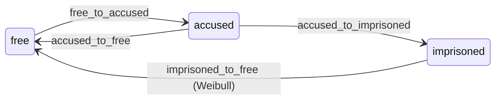
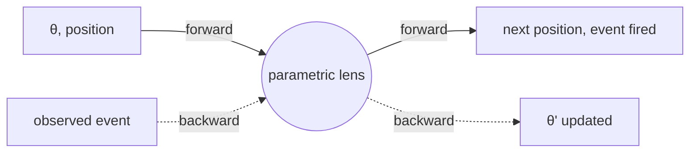
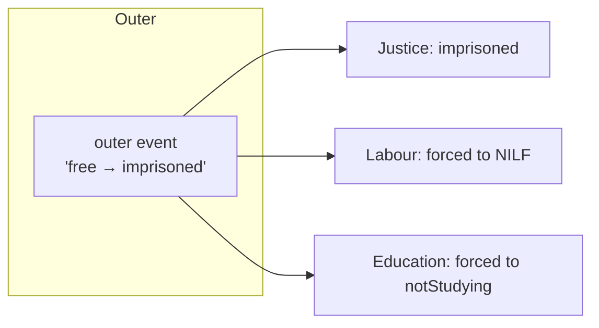
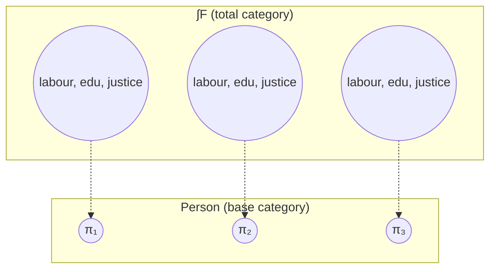
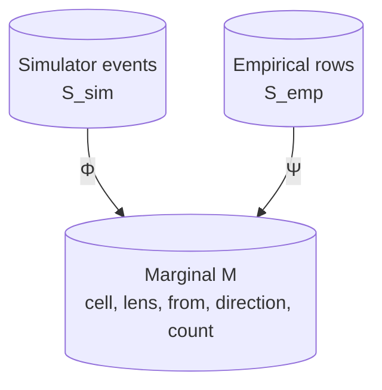
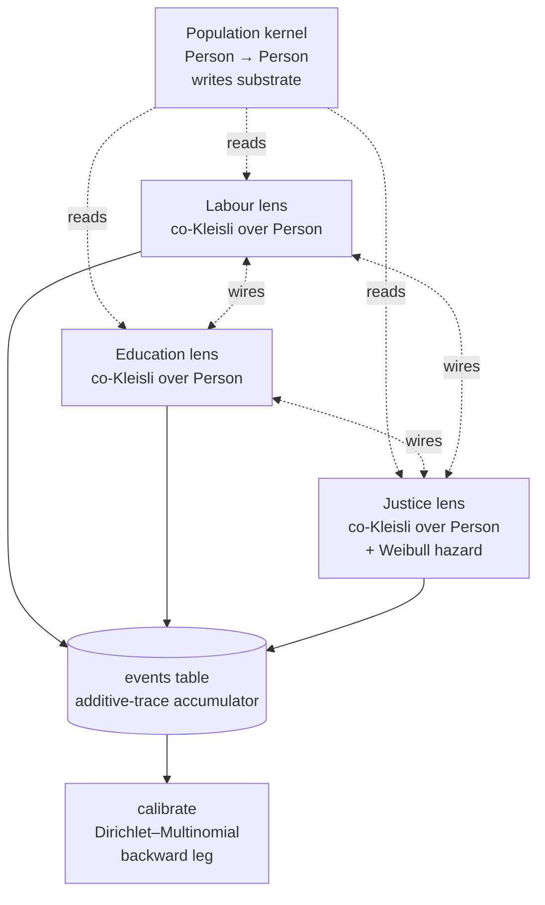

# Compositional Stochastic Systems

**A teaching companion to the `obs-teach` Lean simulator.**

This book accompanies a small Lean&nbsp;4 microsimulator that models a
synthetic cohort of Australians moving through three life lenses — labour,
education, and justice — over a substrate of demographic `Person` records.
The simulator is deliberately tiny; the point is to exhibit, in code, every
structural concept the course introduces. This book sits beside the source
and tells you what each piece is and why it has the shape it does.

---

## Table of contents

- [Front matter](#front-matter)
- [Module 1 — Polynomial coalgebras](#module-1--polynomial-coalgebras)
- [Module 2 — Yoneda &amp; representables](#module-2--yoneda--representables)
- [Module 3 — Parametric lenses](#module-3--parametric-lenses)
- [Module 4 — Markov categories &amp; rate kernels](#module-4--markov-categories--rate-kernels)
- [Module 5 — Categorical Bayes](#module-5--categorical-bayes)
- [Module 6 — The additive trace](#module-6--the-additive-trace)
- [Module 7 — Wirings (double categories)](#module-7--wirings-double-categories)
- [Module 8 — Substrate as fibration](#module-8--substrate-as-fibration)
- [Module 9 — Marginal-schema olog](#module-9--marginal-schema-olog)
- [Module 10 — Calibration as backward leg](#module-10--calibration-as-backward-leg)
- [Module 11 — Capstone](#module-11--capstone)

---

## Front matter

The course this book follows runs in eleven modules. Each chapter here
corresponds to one module and ends with a callout pointing at the Lean file
that implements the concept, with the *full body* of the most interesting
functions reproduced inline. If you want to read the book linearly, you
can; if you want to dive into the simulator and only consult the book when
something is unclear, the cross-references make that easy.

### How to read

Three styles of writing appear together throughout.

**Narrative prose.** Plain English. Most of what you read will be prose
that explains *why* the concept is shaped the way it is — what problem it
solves, what alternative shapes were rejected, what intuition makes it
stick.

**Mathematical notation.** Standard category-theory and probability
notation, rendered with MathJax. Things like $\mathrm{Tr}^X(f) : A \to B$
and the Bayesian-inversion equation
$f^\dagger_p \circ \mathrm{copy}_Y \circ (f \circ p) = \mathrm{copy}_X \circ p$.
Where notation conflicts between sources, we follow the convention that
seems to be settling in the categorical-probability and applied-category-
theory communities (Fritz, Spivak, Libkind &amp; Myers).

**Code excerpts.** Full bodies of the relevant Lean functions, with file
names. The full files live under `../ObsTeach/`. We never quote only
declarations — every callout shows enough of the body for you to see how
the math becomes code.

Diagrams appear inline when they help. They are intentionally sparse —
most string-diagram intuition is more useful when you draw it yourself
than when someone draws it for you. Where diagrams are most natural we use
Mermaid (rendered by GitHub); where ASCII-art is closer to the
string-diagram tradition we use that instead.

### Conventions

- Categories: $\mathcal{C}$, $\mathbf{Set}$, $\mathbf{FinStoch}$,
  $\mathbf{Poly}$, $\mathbf{Para}(\mathcal{C})$.
- Polynomials: $p$, $q$ — with positions $p_{\text{pos}}$ and direction
  sets $p[i]$ for $i \in p_{\text{pos}}$.
- Stochastic morphisms: $f : X \to \mathcal{D}(Y)$ for the discrete
  Giry monad $\mathcal{D}$.
- Lenses: a lens between polynomials has a forward map of positions
  and a backward map of directions; we will draw and write this many
  times.

### What you should be able to do by the end

When you finish the book and read the Lean source from top to bottom,
you should be able to point at any block of code and say *which module of
the course it implements*. The architecture is small enough to keep all
of it in your head once you have the abstractions.

---

## Module 1 — Polynomial coalgebras

> *State machines whose interfaces are typed.*
>
> A polynomial coalgebra is a state machine whose outgoing transitions at
> each state are typed by a position-dependent set of labels. It is the
> structural skeleton on which everything else hangs.

### The motivating story

Open any modelling textbook and you find Markov chains drawn as
diagrams: bubbles for states, arrows for transitions. The arrows are
usually unlabelled or labelled with a single number (the transition
probability). That presentation works, but it loses a lot of structure.
In particular it loses the fact that *the kinds of transitions that are
possible* differ from state to state.

Our justice lens is a good worked example. From the `free` position the
only thing that can happen, in this simplified model, is being accused
of an offence — `free` has one outgoing labelled transition,
`free_to_accused`. From `accused` two things can happen: charges drop
(`accused_to_free`) or the person is sentenced
(`accused_to_imprisoned`). From `imprisoned` only release is possible:
`imprisoned_to_free`. The branching shape is different at each
position. A bare transition matrix encodes the probabilities but
forgets the labels.

We want a representation that *keeps the labels*. The reason is not
aesthetic. The labels are exactly the targets of calibration: when we
calibrate the simulator we will count, for each `(covariate cell,
position)` pair, how many transitions of each *labelled* kind fired.
Lose the labels and you cannot calibrate.

### Polynomial functors

The categorical machinery for "labelled state machine" is the
polynomial functor. Fix a category $\mathcal{C}$ with finite products
and coproducts (we will mostly take $\mathcal{C} = \mathbf{Set}$). A
polynomial functor on $\mathcal{C}$ is

$$ p(X) \;=\; \sum_{i \in p_{\text{pos}}} X^{p[i]}. $$

Here $p_{\text{pos}}$ is a set of *positions* and, for each position
$i$, $p[i]$ is the set of *directions* at that position. Read $p(X)$
as: "for some position $i$, an $X$-valued assignment to each direction
out of $i$."

Concretely, the justice polynomial has

- $p_{\text{pos}} = \{$ free, accused, imprisoned $\}$,
- $p[\text{free}] = \{$ free_to_accused $\}$,
- $p[\text{accused}] = \{$ accused_to_free, accused_to_imprisoned $\}$,
- $p[\text{imprisoned}] = \{$ imprisoned_to_free $\}$.

Every direction has a name, and the name is what calibration will
count.

### Coalgebras

An $F$-coalgebra on a carrier $S$ is a morphism $c : S \to F(S)$. When
$F = p$ for a polynomial $p$, an $S$-state coalgebra produces, at any
state $s$, a position $i$ together with a function
$p[i] \to S$ assigning a next-state to each outgoing direction. That is
exactly "the system is in some position; when a direction fires, here
is the next state."

The simulator's per-lens dynamics is a polynomial coalgebra. The
*deterministic* version says "here is the next state per direction".
The *stochastic* lift of Module 4 says "here is a probability
distribution over the choice of direction". The polynomial structure
is the same in both cases — only the codomain is wrapped in a
distribution monad.

### Diagram



The Justice lens as a polynomial coalgebra. Three positions, four
labelled directions; the dwell time in `imprisoned` is Weibull-
distributed, which Module 4 will explain.

### Why this presentation pays off

Three things become easy that were awkward in the bare-matrix
presentation.

1. **Calibration is structural.** The MLE update for a single
   `(cell, position)` is the multinomial estimator over its directions.
   Because we have the directions named, the estimator is just `count
   per direction / total count` per group.
2. **Wirings are typed.** When the justice lens fires
   `accused_to_imprisoned`, the wiring code says "and labour status
   becomes NILF". Wirings are functions on direction labels, not raw
   integers — they are typed and easy to write.
3. **The polynomial is independent of $\mathcal{C}$.** The same
   structure works in $\mathbf{Set}$ (deterministic), in
   $\mathbf{FinStoch}$ (stochastic), and parametrically (Module 3).

### How this lives in the code

The abstract `Polynomial` and `Coalgebra` types are spelled out in
`ObsTeach/Foundations.lean`:

```lean
structure Polynomial where
  Pos : Type
  Dir : Pos → Type

structure Coalgebra (p : Polynomial) (S : Type) where
  step : S → (i : p.Pos) ×' (p.Dir i → S)
```

The four lenses' positions and directions are declared as small
inductive types and total lookup functions in `ObsTeach/Lenses.lean`.
For the justice lens:

```lean
inductive JusticeState where
  | free | accused | imprisoned
  deriving Repr, DecidableEq, BEq, Inhabited

def justiceDirections : JusticeState → Array String
  | .free       => #["free_to_accused"]
  | .accused    => #["accused_to_imprisoned", "accused_to_free"]
  | .imprisoned => #["imprisoned_to_free"]

def justiceNext : JusticeState → String → JusticeState
  | _, "free_to_accused"        => .accused
  | _, "accused_to_imprisoned"  => .imprisoned
  | _, "accused_to_free"        => .free
  | _, "imprisoned_to_free"     => .free
  | s, _                        => s
```

`justiceDirections` lists $p[i]$ for each position; `justiceNext` is
the deterministic next-state-per-direction handler. In the stochastic
lift of Module 4 these are paired with a rate kernel that decides
*which* direction fires next.

---

## Module 2 — Yoneda &amp; representables

> *Why a lens between polynomials is "exactly" the right shape.*
>
> A polynomial $p$ is a coproduct of representable functors. The Yoneda
> lemma says natural transformations out of representables are just
> elements of the target functor. Together: a morphism between
> polynomials is exactly a forward map of positions plus a backward map
> of directions.

### The Yoneda lemma

For a locally small category $\mathcal{C}$ and an object $A$, the
*representable functor* at $A$ is

$$ h^A \;=\; \mathcal{C}(A,\, -) \;:\; \mathcal{C} \to \mathbf{Set}, $$

sending each $X$ to the set of morphisms $A \to X$ in $\mathcal{C}$.
The **Yoneda lemma** says, for any functor $F : \mathcal{C} \to \mathbf{Set}$,

$$ \mathbf{Nat}(h^A, F) \;\cong\; F(A). $$

A natural transformation out of a representable is in canonical
bijection with a single element of $F(A)$. The proof is a one-liner —
the natural transformation is determined by its component at $A$
applied to $\mathrm{id}_A$.

The lemma is famous for being deceptively simple. It is one of those
foundational results that does not feel like a theorem so much as the
correct definition of representability. But it has real teeth: it
turns "natural transformation" — which is a structure with infinitely
many components related by commuting squares — into a single
element. It collapses a tower into a point.

### From Yoneda to lenses

For our purposes we need one specific consequence. A polynomial
functor

$$ p(X) \;=\; \sum_{i \in p_{\text{pos}}} X^{p[i]} $$

is, term by term, $X^{p[i]} = h^{p[i]}(X)$ — each summand is a
representable. The whole polynomial is a coproduct of representables.

A natural transformation $p \Rightarrow q$ between polynomials decomposes
along this coproduct: for each summand $X^{p[i]}$ of the source we
need a natural transformation into $q$. By Yoneda each such piece is
an element of $q(p[i])$, which itself is a sum:

$$ q(p[i]) \;=\; \sum_{j \in q_{\text{pos}}} (p[i])^{q[j]}. $$

An element of this coproduct is *a position $j$ in $q$ together with a
function $q[j] \to p[i]$*. Writing the position part as $\varphi(i)$
and the function part as $\varphi^\sharp_i$, we get the **lens** data:

- **Forward**:  $\varphi : p_{\text{pos}} \to q_{\text{pos}}$. Every
  position of $p$ knows which position of $q$ it presents.
- **Backward**: $\varphi^\sharp : (i : p_{\text{pos}}) \to q[\varphi(i)] \to p[i]$.
  A direction in the outer (post-) position routes to a direction in
  the inner (pre-) position.

This is the data of a morphism in the category $\mathbf{Poly}$. The
forward leg goes one way, the backward leg goes the other; the
backward leg is *position-dependent*, a small subtlety that ends up
mattering everywhere downstream.

### Where the two legs come from operationally

The forward map says: "to present my system through the outer
interface, here is the outer position to use." The backward map says:
"if the outer interface decides to fire one of its directions, here is
which inner direction it corresponds to." For the simulator this is
exactly *forward = simulate, backward = update*: the forward leg picks
a position to expose, the backward leg routes events back into the
inner system's parameter space.

If you only ever needed deterministic dynamics, that would be the
whole story. The stochastic lift of Module 4 wraps the codomain in a
distribution monad, which preserves the Yoneda decomposition: a
*stochastic* lens is the same forward/backward shape, with the
backward map landing in $\mathcal{D}(p[i])$ instead of $p[i]$.

### How this lives in the code

```lean
structure PolyLens (p q : Polynomial) where
  fwd : p.Pos → q.Pos
  bwd : (i : p.Pos) → q.Dir (fwd i) → p.Dir i
```

Found in `ObsTeach/Foundations.lean`. The Yoneda lemma is *not* proven
in the demo — it would require a substantial amount of category-theory
formalisation. What we *use* it for is structural justification: every
parametric lens we construct has its forward/backward shape derived
from this decomposition. The `Forward` and `Backward` types in
`ObsTeach/ParaLens.lean` (Module 3) are direct extensions of this
pattern with parameters threaded through.

---

## Module 3 — Parametric lenses

> *Forward = simulate, backward = update.*
>
> A parametric lens is a lens whose backward leg threads parameters as
> well as directions. The forward leg is the simulator's per-step
> morphism; the backward leg is calibration. Both halves live in the
> same typed shape.

### The Para construction

Given a monoidal category $\mathcal{C}$ with a chosen *parameter
object* $\Theta$, the **Para construction** produces a new category
$\mathbf{Para}(\mathcal{C})$ with:

- the same objects as $\mathcal{C}$,
- a morphism $X \to Y$ in $\mathbf{Para}$ being a morphism
  $\Theta \otimes X \to Y$ in $\mathcal{C}$,
- composition that threads $\Theta$ through both legs.

In string-diagram form: the parameter wire is fed in from the top,
copied (in a Markov category — Module 4 — copy is part of the
structure), and one copy goes to each composed morphism. Formally,

$$ (\Theta \otimes Y \xrightarrow{g} Z) \circ_{\mathrm{Para}} (\Theta \otimes X \xrightarrow{f} Y) $$

is the morphism

$$ \Theta \otimes X \xrightarrow{(\mathrm{copy}_\Theta \otimes \mathrm{id}_X)} \Theta \otimes \Theta \otimes X \xrightarrow{\mathrm{id}_\Theta \otimes f} \Theta \otimes Y \xrightarrow{g} Z. $$

The Para construction is due to Bruno Gavranović and collaborators. It
is the categorical home for "morphisms with shared parameters" — gradient
descent, learners in neural networks, and our calibration step all live
naturally in some Para category.

### Parametric lenses

A **parametric lens** is a morphism in
$\mathbf{Para}(\mathbf{Lens}(\mathcal{C}))$ for some ambient category
$\mathcal{C}$. Unfolding the definitions, a parametric lens has *four*
pieces of data, organised into a forward leg and a backward leg:

- **Forward**:
  $\mathrm{fwd} : \Theta \times \mathrm{pos}(p) \to \mathrm{pos}(q)$
  takes parameters and an inner position, and produces an outer
  position to expose.
- **Backward**:
  $\mathrm{bwd} : \Theta \times \mathrm{pos}(p) \times \mathrm{dir}(q) \to \Theta \times \mathrm{dir}(p)$
  takes parameters, an inner position, and an outer direction that fired,
  and produces *updated* parameters together with the inner direction
  that the outer event routes to.

In our simulator we will instantiate this in $\mathbf{FinStoch}$, the
Markov category of finite stochastic maps (Module 4). The forward leg
is then a stochastic morphism: it samples the next outer position
given parameters and inner position. The backward leg is the
calibration step: the observed directions update $\Theta$.

### A diagram of one step



Solid arrows are the forward direction (simulate). Dashed arrows are
the backward direction (update). Both share the same lens.

### Why this is the right abstraction

Three things follow from putting the simulator in this shape.

**One.** The forward and backward legs share types. The same parameter
object $\Theta$ is read by the forward leg and written by the backward
leg. We can change calibration strategy (MLE vs MAP vs full Bayesian
posterior) without changing the forward leg. We can change the
forward dynamics (CTMC vs hazard model) without changing the backward
leg's algebra.

**Two.** Parametric lenses *compose*. If lens $L_1$ goes from $p$ to
$q$ (parametrised by $\Theta_1$) and $L_2$ goes from $q$ to $r$
(parametrised by $\Theta_2$), there is a composite from $p$ to $r$
parametrised by $\Theta_1 \otimes \Theta_2$. Operationally: when you
wire two systems together, their parameter spaces tensor; calibrating
the joint system reduces to calibrating the components, which is the
Module 10 modularity story.

**Three.** Within a single lens, the forward and backward legs talk to
each other through $\Theta$. If you change the forward kernel's
parameters between periods (e.g., to reflect time-varying rates), the
backward leg sees the change automatically because it reads the same
parameter object.

### How this lives in the code

The Lean version is a record of two pieces:

```lean
structure Forward (Θ Pos : Type) where
  step : Θ → Pos → RandState → (Pos × String × Float × RandState)

structure Backward (Θ : Type) where
  update : Θ → Array (String × String × String) → Θ
  -- (covariate-cell, from-position, fired-direction)

structure ParaLens (Θ Pos : Type) where
  fwd : Forward Θ Pos
  bwd : Backward Θ
```

Found in `ObsTeach/ParaLens.lean`. The `Forward.step` field unfolds the
Markov-category Kleisli morphism into pure Lean: it takes parameters,
the current position, and a random state, and returns the next
position, the direction label that fired, the elapsed event time, and
a fresh random state. The `Backward.update` field takes the current
parameters and a multiset of observed events (each event is a triple
of cell, from-state, direction) and returns updated parameters.

The simulator never instantiates `ParaLens` directly as a single
record. Instead the forward and backward halves are wired in through
the driver loop in `ObsTeach/Sim.lean` — the forward halves are the
`drawLabour`, `drawEducation`, `drawJustice` functions; the backward
halves are the `calibrate`/`calibrateFromBoth` functions. The
structural shape is the same; the record is shown here to make the
type-level story explicit.

---

## Module 4 — Markov categories &amp; rate kernels

> *Stochastic dynamics, rates, hazards.*
>
> A Markov category is a symmetric monoidal category with a copy and a
> discard, where discard is natural in every morphism. Inside it, a
> rate kernel is the canonical form of every transition in the
> simulator.

### Why we need a stochastic ambient category

Module 1's coalgebras were deterministic: from a state, given a
direction, the next state is determined. A real microsimulator is
stochastic — when an event fires, we sample which direction. We need
an ambient category that supports stochastic morphisms cleanly, with
composition that does the right thing (Chapman–Kolmogorov), copy and
discard that match probabilistic intuition (independent sampling and
marginalisation), and a clear notion of "deterministic" inside the
stochastic setting.

### Markov categories

A **Markov category** $(\mathcal{C}, \otimes, I, \mathrm{copy},
\mathrm{del})$ is a symmetric monoidal category equipped with, for
every object $X$, two natural transformations:

- $\mathrm{copy}_X : X \to X \otimes X$ — comultiplication.
- $\mathrm{del}_X : X \to I$ — counit.

These satisfy commutative-comonoid laws (associativity, unitality,
commutativity), making each $X$ into a commutative comonoid.

The crucial axiom is that **discard is natural in every morphism**:
for every $f : X \to Y$,

$$ \mathrm{del}_Y \circ f \;=\; \mathrm{del}_X. $$

In words: discarding the output of $f$ is the same as not running $f$
at all. In probability terms, this is normalisation: the total
probability mass coming out of any stochastic morphism is one.

The morphisms for which $\mathrm{copy}$ is *also* natural — i.e.,
$f \otimes f \circ \mathrm{copy}_X = \mathrm{copy}_Y \circ f$ — are
exactly the **deterministic** morphisms. So Markov categories give us
a categorical definition of "deterministic" inside a stochastic
setting: copy splits independent samples for stochastic maps, but
preserves duplication for deterministic ones.

### The Markov category we use

$\mathbf{FinStoch}$ has finite sets as objects and stochastic matrices
as morphisms. A morphism $X \to Y$ is a function
$X \times Y \to [0,1]$ with $\sum_y P(x, y) = 1$ for every $x$.
Composition is matrix multiplication, which is exactly the
Chapman–Kolmogorov equation:

$$ (g \circ f)(x, z) \;=\; \sum_y f(x, y)\, g(y, z). $$

Tensor product is cartesian product. Copy is the "stochastic
diagonal": $\mathrm{copy}(x) = \delta_{(x, x)}$. Discard is the unique
map $X \to *$.

### Rate kernels

A discrete-time Markov chain in $\mathbf{FinStoch}$ is a coalgebra
$c : S \to \mathcal{D}(S)$ — at each state, a distribution over next
states. But discrete-time parameters are tied to a chosen tick width.
Calibration shouldn't have to be redone every time you change the
tick. The fix is to drop down to *rates*.

A continuous-time Markov chain (CTMC) is parameterised by a rate
matrix $Q \in \mathbb{R}^{S \times S}$ with

$$ Q[i, j] \geq 0 \quad (i \neq j), \qquad Q[i, i] \;=\; -\sum_{j \neq i} Q[i, j]. $$

Off-diagonal entries are non-negative — they're the rates of
transitioning from one state to another. Diagonal entries are minus
the row sum — they're minus the total rate of leaving the state.
Given $Q$, the per-tick transition matrix at width $\Delta t$ is the
matrix exponential

$$ P(\Delta t) \;=\; \exp(Q\, \Delta t) \;=\; I + Q\,\Delta t + \tfrac{(Q\,\Delta t)^2}{2!} + \cdots $$

And $P(\Delta t_1)\, P(\Delta t_2) = P(\Delta t_1 + \Delta t_2)$ — quarterly
iterated four times equals annual, *automatically*. This is the
property that makes calibration tick-resolution-independent.

### Sampling: competing exponentials

We never compute the matrix exponential at runtime. We sample directly
in event time using competing exponentials:

```
                   T₁ ~ Exp(λ₁)
                   T₂ ~ Exp(λ₂)
                   T₃ ~ Exp(λ₃)

t = 0  ────×───×──────×─────────────────  time
           T₁  T₂     T₃
           ↑
        winner: smallest time fires
```

Independently for each direction, draw a candidate event time from an
exponential with that direction's rate. The earliest one fires. By a
beautiful fact about exponentials, $\min_i T_i \sim \mathrm{Exp}(\sum_i
\lambda_i)$ and the winning index is categorical with weights
$\lambda_i / \sum_j \lambda_j$ — equivalent to "exponential sojourn
time + categorical direction" but generalising uniformly to non-
exponential hazards (next subsection).

### Hazard models

The exponential is *memoryless*: $\Pr(T > t+s \mid T > s) = \Pr(T > t)$.
Fine for radioactive decay; wrong for prison sentences, which empirically
have a length. The conditional probability of being released next month,
given you've been inside for eight years of a ten-year sentence, is much
higher than for someone who arrived yesterday.

We replace the constant rate with a hazard $\lambda(\tau)$ depending on
time-in-state $\tau$. The cumulative hazard is

$$ \Lambda(\tau) \;=\; \int_0^\tau \lambda(u)\, du $$

and the survival function is $S(\tau) = \exp(-\Lambda(\tau))$. The
density is $f(\tau) = \lambda(\tau)\, S(\tau)$. For our prison stay we
use a **Weibull hazard** with shape $k$ and scale $\eta$:

$$ \lambda(\tau) \;=\; \frac{k}{\eta} \left(\frac{\tau}{\eta}\right)^{k-1}. $$

For $k > 1$ the hazard rises with time served (capturing
sentence-length structure); for $k < 1$ it falls; for $k = 1$ it
reduces to the exponential. We use $k = 1.5$, $\eta = 1.5$ years.

Sampling from a Weibull is by inverse CDF:
$\tau = \eta \cdot (-\log(1 - U))^{1/k}$ for $U \sim U(0, 1)$.

### How this lives in the code

The PRNG is a SplitMix-style LCG. State-passing keeps everything pure:

```lean
abbrev RandState := UInt64

@[inline] def step (s : RandState) : RandState :=
  s * 6364136223846793005 + 1442695040888963407

def uniform01 (s : RandState) : Float × RandState :=
  let s' := step s
  let bits : UInt64 := s' >>> 11
  let u : Float := bits.toNat.toFloat / 9007199254740992.0
  (u, s')
```

The exponential sampler is inverse-CDF, one line of body:

```lean
def expSample (rate : Float) (s : RandState) : Float × RandState :=
  let (u, s') := uniform01 s
  let t := -(Float.log (1.0 - u)) / rate
  (t, s')
```

The Weibull sampler is similar:

```lean
def weibullSample (shape scale : Float) (s : RandState) : Float × RandState :=
  let (u, s') := uniform01 s
  let x := -(Float.log (1.0 - u))
  -- x^(1/shape) = exp(log(x)/shape)
  let t := scale * Float.exp (Float.log x / shape)
  (t, s')
```

Competing exponentials are the workhorse of the forward leg:

```lean
def competingExp (rates : Array Float) (s : RandState)
    : (Nat × Float × RandState) := Id.run do
  let total := rates.foldl (· + ·) 0.0
  if total ≤ 0.0 then
    -- absorbing state
    pure (0, 1.0e30, s)
  else
    let (t, s1) := expSample total s
    let probs := rates.map (· / total)
    let (i, s2) := categorical probs s1
    pure (i, t, s2)
```

Notice the structure: sample the *time* from the total-rate exponential,
then sample the *index* from the rate-weighted categorical. Two
samples instead of N, and the result is provably equivalent.

The justice lens overrides the constant-rate kernel for the
`imprisoned` position and computes a Weibull hazard at the current
time-in-state instead:

```lean
def weibullHazard (shape scale τ : Float) : Float :=
  if τ ≤ 0.0 then (shape / scale) * 1.0e-6
  else
    -- (k/η) * (τ/η)^(k-1) = (k/η) * exp((k-1) * log(τ/η))
    let r := τ / scale
    (shape / scale) * Float.exp ((shape - 1.0) * Float.log r)
```

The forward step at `imprisoned` then does competing exponentials with
this single hazard rate, which is the inverse-CDF Weibull draw in
disguise. (Module 11 walks through the full `drawJustice` body.)

The `Discretise(\Delta t)` operator from Module 7 is also
implemented but not used at simulation time — we sample in event time
directly. It is shown in `ObsTeach/Markov.lean` for explanatory
completeness:

```lean
def discretise (row : RateRow) (dt : Float) : Array (String × Float) := Id.run do
  let total := row.foldl (fun acc (_, r) => acc + r) 0.0
  if total ≤ 0.0 then
    pure #[("__stay__", 1.0)]
  else
    let pAny := 1.0 - Float.exp (- total * dt)
    let outRows := row.map (fun (d, r) => (d, (r / total) * pAny))
    pure (outRows.push ("__stay__", 1.0 - pAny))
```

This is the first-order approximation $P(\Delta t) \approx I + Q\, \Delta t$
expressed as per-direction probabilities: each off-diagonal direction
has probability $(\lambda_i / \lambda_{\text{total}}) \cdot
(1 - e^{-\lambda_{\text{total}} \Delta t})$, with the residual mass on
the self-loop "stay" direction.

---

## Module 5 — Categorical Bayes

> *Inversion, conjugacy, naturality.*
>
> Bayes' rule is a categorical operation. In a Markov category, the
> Bayesian inverse of a likelihood given a prior is the morphism that
> makes both ways of constructing the joint distribution agree.

### Bayes as an operation

Bayes' rule in undergraduate textbooks is an algebraic identity:

$$ P(\theta \mid d) \;=\; \frac{P(d \mid \theta)\, P(\theta)}{P(d)}. $$

You apply it, you get a number, you move on. Read more carefully it
describes an *operation*: take a prior $P(\theta)$, a likelihood
$P(d \mid \theta)$, and an observation $d$; produce a posterior
$P(\theta \mid d)$. The categorical reformulation makes this operation
first-class.

### Bayesian inversion in a Markov category

Fix a Markov category $\mathcal{C}$. Take a *prior* $p : I \to X$ — a
distribution on $X$ — and a *likelihood* $f : X \to Y$ — a stochastic
map. Together they determine a **joint distribution** on $X \otimes Y$
via copy:

$$ \mathrm{joint}_{p, f} \;=\; (\mathrm{id}_X \otimes f) \circ \mathrm{copy}_X \circ p \;:\; I \to X \otimes Y. $$

In string-diagram form: copy $p$ to get two outputs; pass one through
$f$ to get $Y$; keep the other as $X$. The marginal on $Y$ is the
*predictive distribution*, $f \circ p : I \to Y$.

A **Bayesian inverse** of $f$ relative to $p$ is a morphism
$f^\dagger_p : Y \to X$ such that the joint constructed *backwards*
from the predictive equals the joint constructed forwards:

$$ (f^\dagger_p \otimes \mathrm{id}_Y) \circ \mathrm{copy}_Y \circ (f \circ p) \;=\; (\mathrm{id}_X \otimes f) \circ \mathrm{copy}_X \circ p. $$

That's the entire definition. Two ways of building the joint
distribution. The Bayesian inverse is the morphism that makes them
agree.

Three observations about this definition.

**It depends on the prior.** Different priors give different inverses.
There is no universal "Bayesian inverse of $f$" — only $f^\dagger_p$
for a chosen $p$. Notation that suggests otherwise (like $f^{-1}$) is
misleading.

**It is not a left or right inverse.** $f \circ f^\dagger_p \neq
\mathrm{id}_Y$ in general, and $f^\dagger_p \circ f \neq \mathrm{id}_X$.
What's preserved is the *joint*, not the individual morphisms.

**In $\mathbf{FinStoch}$ it is the textbook formula.** With $f$ a
stochastic matrix and $p$ a probability vector, the inversion equation
unpacks to

$$ f^\dagger_p(y, x) \;=\; \frac{f(x, y)\, p(x)}{(f \circ p)(y)} $$

provided the denominator is non-zero. The categorical equation and the
algebraic formula are the same artefact.

### Diagram of the two joints

```
     p                        f∘p
     │                         │
   copy                       copy
   ╱  ╲                       ╱  ╲
  ╱    ╲                     ╱    ╲
 │     f          ≡         f†     │
 │     │                     │     │
 X     Y                     X     Y
```

Both diagrams construct a distribution on $X \otimes Y$. The Bayesian
inverse $f^\dagger_p$ is the unique (on the support) morphism making
them equal.

### Conjugacy

In general the Bayesian inverse can be ugly. Start with a Beta prior
on a coin and a Bernoulli likelihood: posterior is Beta. Lovely. Start
with a Gaussian prior on a Bernoulli likelihood: posterior is some
non-standard density. Try this two more times and the functional form
deteriorates fast.

What we want is the case where the posterior stays in the same family
as the prior. This is **conjugacy**: a prior family $\{P_\xi\}_{\xi \in
\Xi}$ is conjugate to a likelihood when there is an *update map*

$$ u : \Xi \times D \to \Xi $$

with $f^\dagger_{P_\xi}(d) = P_{u(\xi, d)}$. The Bayesian inverse
collapses to an endomorphism on $\Xi$. After many observations the
posterior is still in the family — only its parameter has shifted.

For our simulator the relevant pair is **Dirichlet–Multinomial**. The
likelihood is multinomial on $K$ outcomes; the prior is
$\mathrm{Dirichlet}(\alpha)$ for $\alpha \in \mathbb{R}^K_{>0}$;
observing a count vector $n = (n_1, \dots, n_K)$ gives

$$ \theta \mid n \;\sim\; \mathrm{Dirichlet}(\alpha + n). $$

The update is **componentwise addition**. That's it. The Dirichlet
posterior parameters are the prior pseudo-counts plus the observed
counts. No matrix algebra, no normalisation constants, no integrals —
just `+`.

### Posterior summaries and where MLE comes from

The posterior $\mathrm{Dirichlet}(\alpha + n)$ has standard summaries:

$$ \mathbb{E}[\theta_k \mid n] \;=\; \frac{\alpha_k + n_k}{\sum_j (\alpha_j + n_j)}, \qquad \mathrm{MAP}_k \;=\; \frac{\alpha_k + n_k - 1}{\sum_j (\alpha_j + n_j - 1)}. $$

Three special cases worth knowing:

- $\alpha = (\tfrac12, \dots, \tfrac12)$ (Jeffreys prior) and posterior
  *mean* gives the BLUEPRINT &sect;5.1 estimator. This is what the demo
  uses by default.
- $\alpha = (1, \dots, 1)$ (uniform prior) and posterior *mode* gives
  the frequentist MLE: $\hat\theta_k = n_k / \sum_j n_j$.
- $\alpha = (0, \dots, 0)$ (improper prior) and posterior *mean* also
  gives the MLE — but the prior is degenerate and the formula breaks
  for $n_k = 0$.

One implementation supports all three. You change which summary you
read.

### Naturality

The update map is **natural** in the data. Sequential and batch
updates give the same posterior:

$$ u(u(\xi, d_1), d_2) \;=\; u(\xi, (d_1, d_2)). $$

For Dirichlet this is associativity of $\mathbb{R}^K$ addition. The
categorical content is that *modular calibration is sound*:
calibrating per-cell, per-period, possibly across data sources, and
combining the results, equals calibrating once on the pooled data.
Without this property, online learning would be impossible and the
modular architecture would be a lie.

### How this lives in the code

The Lean implementation is straight algebra:

```lean
abbrev Dirichlet := Array (String × Float)

def update (α : Dirichlet) (counts : Array (String × Nat)) : Dirichlet :=
  α.map fun (d, x) =>
    let n := (counts.find? (·.1 = d)).map (·.2) |>.getD 0
    (d, x + n.toFloat)

def fromCounts (directions : Array String) (counts : Array (String × Nat)) : Dirichlet :=
  let prior : Dirichlet := directions.map (fun d => (d, 0.5))
  update prior counts

def posteriorMean (α : Dirichlet) : Array (String × Float) :=
  let total := α.foldl (fun acc (_, x) => acc + x) 0.0
  if total ≤ 0.0 then α
  else α.map (fun (d, x) => (d, x / total))
```

Found in `ObsTeach/Bayes.lean`. The whole file is shorter than this
chapter. The naturality fact is *exercised* in `Tests.lean` by a
property test that compares sequential and batch updates on random
inputs — sequential ≡ batch ≡ associativity of float addition.

```lean
def testUpdateNaturality : IO Bool := do
  let prior : Dirichlet := #[("a", 0.5), ("b", 0.5), ("c", 0.5)]
  let c1 : Array (String × Nat) := #[("a", 2), ("b", 1)]
  let c2 : Array (String × Nat) := #[("a", 3), ("c", 4)]
  -- Sequential: update with c1 then c2.
  let seq := update (update prior c1) c2
  -- Batch: combine counts and update once.
  let combined : Array (String × Nat) := #[("a", 5), ("b", 1), ("c", 4)]
  let batch := update prior combined
  let same := seq.all fun (d, x) =>
    (batch.find? (·.1 = d)).map (·.2) == some x
  report "Bayes: sequential ≡ batch (naturality)" same
```

---

## Module 6 — The additive trace

> *Within-period dynamics as a feedback loop with a side accumulator.*
>
> The events table is the accumulator value of an additive trace. The
> DuckDB `GROUP BY` queries that compute per-period summaries are
> *folds* over that accumulator.

### The categorical trace

A **traced monoidal category** is a symmetric monoidal category with,
for every triple of objects $A, B, X$, a function

$$ \mathrm{Tr}^X_{A, B} \;:\; \mathrm{Hom}(A \otimes X,\, B \otimes X) \;\to\; \mathrm{Hom}(A, B) $$

satisfying a list of axioms (yanking, vanishing, dinaturality,
exchange, superposing). Operationally: take a morphism with a
feedback-able $X$ wire, close the loop, and report just $A \to B$.

```
   A ─┬───────── A
      │
   ┌──▼──┐         ┌─────┐
   │     │  ──►    │ Tr  │
   │  f  │         │     │
   │     │         └──┬──┘
   └──┬──┘            │
      │ X→X           ▼
      └──┐            B
         │
   B ◄───┘
```

In string-diagram form: the trace draws a wire from the $X$-output
back around to the $X$-input, leaving $A$ and $B$ exposed.

### Specialisations of the trace

What the trace *is*, concretely, depends on the ambient category.

- In $\mathbf{Vect}^{\mathrm{fd}}$ (finite-dimensional vector spaces),
  the trace is the linear-algebra trace. Sum over a basis of $X$,
  contract the indices.
- In $\mathbf{Rel}$ (sets and relations), the trace is *existential
  closure*: $\{(a, b) \mid \exists x.\ (a, x) \mathrel{R} (b, x)\}$.
- In $\mathbf{PFun}$ (sets and partial functions), the trace is
  *iteration with a halting condition*. Given $f : A + X \to B + X$,
  feed your input in, run $f$, if you get an $X$ result feed it back,
  if you get a $B$ result stop. This is the Kleene-style fixed-point
  construction and is the reading we want for the simulator.

### The simulator's loop is a trace

The within-period simulator iteration, abstracted:

- **Loop state** $X$: position, time-in-state, halt flag.
- **Input** $A$: parameters, starting state, period bounds.
- **Output** $B$: end-of-period state, halt reason.

The body $f$ takes loop state to loop state plus a halt bit. The
trace closes the loop and reports the final state when the halt bit
flips. Exponentials are memoryless so restarting the clock at the
period boundary is fine; the Weibull hazard requires us to remember
`prisonEntered` so that $\tau$ is the absolute elapsed time, not just
within-period.

### The flaw with the plain trace

The plain trace throws away the iterations. It only reports the final
output. We don't want only the final output. We want the *events* —
every transition that fired during the period, with timestamp and
direction label. Those events are what calibration ingests; if the
trace throws them away, we have lost the thing that matters.

### The additive trace

The fix is to augment $f$ with a side-channel output in a commutative
monoid $(M, \cdot, e)$:

$$ f \;:\; A \otimes X \to B \otimes X \otimes M, \qquad \mathrm{Tr}^X_{\oplus M}(f) \;:\; A \to B \otimes M. $$

Each iteration contributes an element of $M$; iterations combine by
the monoid product, with the unit $e$ as the initial accumulator.

For our simulator $M$ is the **bag of events** — multisets of
`(person, period, time, lens, from, direction)` tuples under multiset
union. Each iteration of the trace contributes one event. The whole
trace's accumulator value is the multiset of all events that fired
during the period.

**That bag is the events table.** Stored as `Array Event` in memory,
written as a CSV to disk. The categorical name and the database name
are the same artefact.

### The four-function interface

BLUEPRINT decomposes the per-lens trace as four named functions:

| Name       | Categorical role         |
|---         |---                       |
| `draw`     | the iteration step $f$   |
| `split`    | the halt predicate       |
| `accumulate` | the monoid multiplication |
| `emit`     | projection from $M$ to a per-period observable |

In DuckDB the `emit` is a `GROUP BY` over the events table. In our
Lean simulator the events table is `Array Event` and `emit` is any
`Array.foldl` over it. The expensive part is running the trace; the
cheap part is choosing what fold to apply.

### How this lives in the code

The events row type:

```lean
structure Event where
  personId   : Nat
  period     : Nat
  time       : Float
  lens       : String
  fromState  : String
  direction  : String
  deriving Repr

def Event.toCsv (e : Event) : String :=
  s!"{e.personId},{e.period},{e.time},{e.lens},{e.fromState},{e.direction}"

def eventsHeader : String :=
  "person_id,period,time,lens,from_state,direction"
```

The body of the trace itself, generic over the per-lens kernel:

```lean
partial def runWithinPeriod
    (personId : Nat) (period : Nat) (lens : String)
    (keyOf : String → String) (transition : String → String → String)
    (draw : DrawStep)
    (start : Float) (periodEnd : Float) (state : String)
    (s : RandState)
    : (Array Event × String × Float × RandState) :=
  let rec loop (cur : String) (now : Float) (s : RandState) (acc : Array Event)
      : (Array Event × String × Float × RandState) :=
    let key := keyOf cur
    let (eventTime, direction, s') := draw key now s
    if eventTime ≥ periodEnd then
      -- Period boundary — close the loop.
      (acc, cur, periodEnd, s')
    else
      let event : Event :=
        { personId, period, time := eventTime, lens,
          fromState := cur, direction }
      let next := transition cur direction
      loop next eventTime s' (acc.push event)
  loop state start s #[]
```

Both in `ObsTeach/Trace.lean`. Read the inner `loop` directly: it's
the categorical trace's body. `key := keyOf cur` is the covariate-
cell-and-position lookup key. `draw key now s` is the iteration step
$f$ — it samples the next event time and direction from the
appropriate rate row and returns a new random state. The `if
eventTime ≥ periodEnd then (acc, cur, periodEnd, s')` clause is the
halt predicate firing on the period boundary. The `else` branch is
the recursive call: append the event to the accumulator (`acc.push
event`), advance the inner state via `transition`, and recurse with
the new event time as the new "now".

Notice the loop never restarts the clock. Time advances strictly. The
accumulator is `Array.push`'d once per iteration. When the loop
returns, the accumulator value is the multiset of events that fired
during this person's pass through this lens during this period.

For the simulator's joint-lens case (the additive trace at the level
of the parallel composite of lenses), the within-period dynamic is
implemented in `runPersonPeriod` of `ObsTeach/Sim.lean`. We will see
that function in Module 11; it is a straightforward generalisation of
the body above, with three competing draws per iteration instead of
one.

---

## Module 7 — Wirings (double categories)

> *Cross-lens constraints as backward legs of wiring lenses.*
>
> A double category has two perpendicular kinds of arrow. Horizontal
> arrows wire systems together; vertical arrows swap an
> implementation while preserving the interface. The two-cell
> coherence says these axes commute.

### Two operations that aren't the same

Suppose you have two lenses — call them justice and labour — and you
want to combine them. There are two operations you might mean.

The first is **plumbing**. You declare that when justice fires
`accused_to_imprisoned`, labour is forced to NILF. You declare that
when labour fires `working_to_unemployed`, no constraint is imposed on
justice. The two systems get wired together into a combined system
with one joint state space and a coordinated transition story. This
is *combining two systems into a bigger one*.

The second is **implementation-swapping**. You want to replace the
constant-rate prison kernel with a Weibull-hazard one. The interface
is unchanged — same positions, same direction labels — but the
implementation is now richer. This is *replacing one system with
another that has the same interface but different guts*.

These are different operations, and operadic composition (the natural
formalism for plumbing) cannot express implementation-swapping. We
need a richer structure that organises both, and tells us they don't
interfere with each other.

### Double categories

A **double category** has two perpendicular kinds of arrow. Objects
sit on the corners; horizontal arrows are one direction of
composition; vertical arrows are the other; **2-cells** (squares)
record agreement between horizontal and vertical operations.

The **double category of systems** $\mathbf{Sys}$, due to Libkind &amp;
Myers, organises our two operations:

- **Objects** — interfaces (polynomials).
- **Horizontal arrows** — *wirings*; lenses out of the parallel
  composite of inner systems into a refined outer interface.
- **Vertical arrows** — *behaviour-preserving morphisms*. Same
  interface, swapped implementation. The
  $\mathrm{Discretise}(\Delta t)$ operator is one. The hazard wrap is
  another. The covariate-cell coarsening is a third.
- **2-cells** — coherence squares stating that horizontal and
  vertical operations commute.

The 2-cells are the structural payoff. They say you can
discretise-then-wire or wire-then-discretise and get the same answer.
You can hazard-wrap one lens without revisiting the wiring around
it. You can coarsen one lens's carrier without disturbing anything
else.

### Parallel product and wirings in our demo

Concretely, the parallel product $\otimes$ on polynomials puts two
lenses side by side. Joint positions are pairs; joint directions are
pairs; joint coalgebras are products. The parallel product is
permissive — it allows joint positions like "imprisoned-and-working"
that should never arise.

The **wiring** is the lens out of the parallel composite that cuts
down to the legal joint positions and routes outer events to
coordinated inner events. We implement it in `ObsTeach/Wiring.lean`
as a small set of pairwise constraint functions, applied after each
inner transition.

### Wiring fan-out



One outer event, three coordinated inner events. The wiring's
backward leg is what does the routing.

### How this lives in the code

```lean
inductive LabourState where
  | working | unemployed | nilf
  deriving Repr, DecidableEq, BEq, Inhabited

inductive EducationState where
  | inSchool | inUniversity | notStudying
  deriving Repr, DecidableEq, BEq, Inhabited

inductive JusticeState where
  | free | accused | imprisoned
  deriving Repr, DecidableEq, BEq, Inhabited

structure JointState where
  person          : Person
  labour          : LabourState
  education       : EducationState
  justice         : JusticeState
  prisonEntered   : Float
  deriving Repr
```

The wiring functions themselves are total functions on inductive
types. The Justice → Labour wiring:

```lean
def wireJusticeToLabour (oldJ newJ : JusticeState) (l : LabourState) : LabourState :=
  match oldJ, newJ with
  | _, .imprisoned     => .nilf
  | .imprisoned, .free => .unemployed
  | _, _               => l
```

Three lines. Imprisonment forces NILF (overriding whatever labour
status the person had). Release from prison routes them to
unemployed. All other transitions leave labour untouched.

The Justice → Education wiring is the same shape:

```lean
def wireJusticeToEducation (_oldJ newJ : JusticeState)
    (e : EducationState) : EducationState :=
  match newJ with
  | .imprisoned => .notStudying
  | _           => e
```

The Education → Labour wiring:

```lean
def wireEducationToLabour (oldE newE : EducationState)
    (l : LabourState) : LabourState :=
  match oldE, newE with
  | _, .inSchool      => .nilf
  | _, .inUniversity  => .nilf
  | .inSchool, .notStudying     => .unemployed
  | .inUniversity, .notStudying => .unemployed
  | _, _              => l
```

Entering school or university forces NILF. Leaving education routes
to unemployed.

The Age → Education wiring is the only one driven by a base-level
demographic move, not a lens-internal transition. It is the
reindexing functor of the substrate fibration (Module 8) made
concrete:

```lean
def wireAgeToEducation (age : Nat) (e : EducationState) : EducationState :=
  if age < 16 then .inSchool
  else
    match e with
    | .inUniversity => if age > 25 then .notStudying else .inUniversity
    | _ => e
```

Anyone under 16 must be in school. Anyone over 25 cannot be in
university; if they are, push them to notStudying.

These wirings compose as small total functions. Three of them are
applied after each Justice transition; one after each Education
transition; one after each ageing event. The composite — the joint-
system transition — is

```lean
def applyJusticeWirings (oldJ newJ : JusticeState) (st : JointState) : JointState :=
  { st with
    justice   := newJ
    labour    := wireJusticeToLabour oldJ newJ st.labour
    education := wireJusticeToEducation oldJ newJ st.education }

def applyEducationWirings (oldE newE : EducationState) (st : JointState)
    : JointState :=
  { st with
    education := newE
    labour    := wireEducationToLabour oldE newE st.labour }

def applyAgeWirings (newAge : Nat) (st : JointState) : JointState :=
  let p' := { st.person with age := newAge }
  { st with
    person    := p'
    education := wireAgeToEducation newAge st.education }
```

Sequential composition of pairwise wirings. The whole file is short;
the whole double-categorical content compresses into about thirty
lines of Lean. What makes the architecture work is not the volume of
code but the *typing*: every wiring is a typed function on the inner
states, so it is impossible to accidentally write a wiring that, say,
modifies `Person.id`.

---

## Module 8 — Substrate as fibration

> *Person is the base, every lens is a fibre.*
>
> Every lens reads the substrate. Only Population writes to it.
> Categorically: the joint state is the Grothendieck construction of a
> Person-indexed family of per-lens fibres.

### Slice categories

For a category $\mathcal{C}$ and an object $B$, the **slice category**
$\mathcal{C}/B$ has:

- objects: morphisms $X \to B$ in $\mathcal{C}$;
- morphisms $(X \to B) \to (Y \to B)$: morphisms $X \to Y$ in
  $\mathcal{C}$ commuting with the maps to $B$.

In $\mathbf{Set}/B$, an object is a function $X \to B$ and the same
data is a $B$-indexed family of disjoint sets via fibre decomposition.
For our simulator, with $B = \mathrm{Person}$, every per-lens carrier
$\mathrm{Person} \times \mathrm{LabourState}$ etc. is naturally an
object of the slice — projection to Person is its structure map.

### Fibrations

A **fibration** $p : \mathcal{E} \to \mathcal{B}$ is a functor with
a *cartesian-lifting* structure. For each base object $b$ the
**fibre** $\mathcal{E}_b = p^{-1}(b)$ is a category in its own right.
The cartesian liftings tie fibres together coherently along base
morphisms.

The **Grothendieck correspondence** equates fibrations over
$\mathcal{B}$ with pseudofunctors

$$ F : \mathcal{B}^{\mathrm{op}} \to \mathbf{Cat}. $$

Going one way: a fibration's fibres assemble into a pseudofunctor.
Going the other: a pseudofunctor's total category $\int F$ is a
fibration over $\mathcal{B}$. The two views are equivalent. The
fibration view is geometric; the pseudofunctor view is local.

### The substrate fibration

For our simulator, take $\mathcal{B} = \mathrm{Person}$. The
pseudofunctor assigns to each person $\pi$ the category whose objects
are all per-lens states for $\pi$. The total category
$\int F$ has objects $(\pi, \text{tuple of per-lens states})$, which
is exactly our `JointState` record.



The fibre over each $\pi$ is the product of that person's per-lens
states. The dotted arrows are the projection $\pi : \int F \to
\mathrm{Person}$ — every joint state knows which person it belongs to.

### The Reader perspective

The dual operational view: every domain-lens kernel is a **co-Kleisli
morphism** in the *Reader comonad* on Person. It takes Person as
context and produces a transition without modifying the Person record.

The Reader comonad on a context $A$ has $W(X) = X^A$. A co-Kleisli
morphism from $X$ to $Y$ is a function $W(X) \to Y$, equivalently
$A \times X \to Y$ — a function with extra context $A$ available. For
our simulator $A = \mathrm{Person}$ and the kernels look like:

```lean
abbrev ReaderKernel (S Out : Type) := Person → S → Out
```

Every domain-lens kernel reads Person and produces a transition
without writing back to Person. This is operationally what "co-
Kleisli for Reader on Person" means.

### Population is special

Population's kernel doesn't factor through Reader. It writes to
Person — ageing, region change, demographic update. So Population is
the only kernel in the *ambient* category that can change the base
object:

```lean
abbrev PopulationKernel := Person → Person
```

The substrate theorem makes this precise. In the slice category
$\mathbf{Set}/\mathrm{Person}$, the Population lens's slice object is
$\mathrm{id}_{\mathrm{Person}}$ — the identity arrow on Person. Every
domain lens admits a unique slice-morphism *into* this object given
by its own projection. So every domain lens "factors through"
Population in the slice category. This is the categorical statement
of "Population is the unique lens whose carrier *is* the substrate".

The architectural consequences:

1. **Per-lens calibration is automatically modular.** Updating one
   lens's parameters touches its co-Kleisli kernel and nothing else.
2. **Population dynamics are isolated.** Births, deaths, ageing,
   migration — these are exactly the moves that can change Person, so
   they can only happen in Population.
3. **Demographic transitions reindex everything uniformly.** When a
   person ages, the corresponding base morphism transports per-lens
   states via the pseudofunctor's reindexing functor (Module 7's age
   wirings do this).
4. **The pipeline DAG is fibrewise.** Wirings between domain lenses
   are within-fibre operations. The topological sweep across lenses
   happens person-by-person, without cross-person coupling.

### How this lives in the code

The Person record:

```lean
inductive Sex where
  | male | female
  deriving Repr, DecidableEq, BEq, Inhabited

inductive Region where
  | major | regional | remote
  deriving Repr, DecidableEq, BEq, Inhabited

structure Person where
  id        : Nat
  age       : Nat
  sex       : Sex
  region    : Region
  cohort    : Int
  deriving Repr, Inhabited
```

The covariate-cell coarsening — a behaviour-preserving morphism in
the sense of Module 7, taking rich `Person` records to the calibration
GROUP-BY key:

```lean
def Person.cell (p : Person) : String :=
  let ageBand :=
    if p.age < 20      then "0-19"
    else if p.age < 35 then "20-34"
    else if p.age < 50 then "35-49"
    else if p.age < 65 then "50-64"
    else "65+"
  let sex := match p.sex with | .male => "M" | .female => "F"
  let reg := match p.region with
    | .major => "major" | .regional => "regional" | .remote => "remote"
  s!"{ageBand}|{sex}|{reg}"
```

Found in `ObsTeach/Substrate.lean`. The cell function is a total
function from rich Person records into the small set of
`age_band|sex|region` strings. Categorically, it is the projection
$\mathrm{Person} \to \mathrm{cell}$ — the structural reason why
calibration can group by cell at all.

---

## Module 9 — Marginal-schema olog

> *A common ground that lets multiple sources contribute to one
> posterior.*
>
> An *olog* is a categorical schema. A schema morphism is a functor
> between schemas. Functorial data migration moves data along it. The
> marginal-schema olog is the schema that simulator events and
> external empirical rows share — the common ground of calibration.

### Ologs as schemas

Following Spivak &amp; Kent, a schema is a (small) category. Objects are
*types* (entity sets, attribute sets). Morphisms are *functions*
between them (foreign keys, derived attributes). An *instance* is a
functor from the schema into $\mathbf{Set}$ — assigning each object
to a set of records and each morphism to a function between them.

This is just relational schema design dressed up categorically, and
it pays off because functors and natural transformations *also*
become first-class. A schema morphism is a functor between schemas;
an instance migration is a way of moving data along it.

### Functorial data migration (FDM)

For a schema morphism $\Phi : T \to S$, three associated migration
functors move instances along it:

- $\Delta_\Phi : \mathbf{Inst}(S) \to \mathbf{Inst}(T)$ — pullback.
  Cheap. Just renames columns. Defined by $(\Delta_\Phi I)(x) =
  I(\Phi(x))$.
- $\Sigma_\Phi : \mathbf{Inst}(T) \to \mathbf{Inst}(S)$ — left Kan
  extension. Aggregate / disjoint-union.
- $\Pi_\Phi : \mathbf{Inst}(T) \to \mathbf{Inst}(S)$ — right Kan
  extension. Tuple / product-aggregate.

The pullback $\Delta$ is what we use. It is the migration that "reads
data through a schema morphism" without doing any aggregation —
useful when a small target schema can be embedded into a large
source schema by a functor going *the other way*.

### The marginal-schema olog

The simulator's event schema $S_{\text{sim}}$ is rich: each event has
a person id, a period, a time, a lens, a from-state, a direction. An
external empirical schema $S_{\text{emp}}$ may be quite different —
maybe AIHW publishes annual transition counts by age band and region.
Calibration needs to consume both.

The trick is to find a *common ground* schema $M$ — small enough that
both source schemas admit morphisms *from* $M$. Then both sources
push back data to $M$-shaped rows via the $\Delta$ migrations.



Both data sources admit schema morphisms into the marginal-schema
olog $M$. Calibration consumes $M$-shaped rows.

The marginal schema we use has five attributes:
$\{$cell, lens, from-state, direction, count$\}$. Every event is
projected to a row with count 1; every external row already has a
count. Aggregation by `(cell, lens, from-state, direction)` sums the
counts. The result is fed to the conjugate-update calibration in
Module 10.

### How this lives in the code

The marginal row type:

```lean
structure MarginalRow where
  cell      : String
  lens      : String
  fromState : String
  direction : String
  /-- Number of observed transitions of this kind. -/
  count     : Nat
  deriving Repr
```

A schema morphism into $M$ is, by definition, a function from the
source row type to `MarginalRow`:

```lean
abbrev SchemaMorphism (Source : Type) := Source → MarginalRow
```

The aggregate function — categorically, the $\Sigma$ migration
that disjoint-union aggregates — is implemented as a hash-map fold:

```lean
def aggregate (rows : Array MarginalRow) : Array MarginalRow := Id.run do
  let mut acc : Std.HashMap String MarginalRow := {}
  for r in rows do
    let key := s!"{r.cell}|{r.lens}|{r.fromState}|{r.direction}"
    match acc[key]? with
    | some existing =>
        acc := acc.insert key { existing with count := existing.count + r.count }
    | none =>
        acc := acc.insert key r
  pure (acc.toArray.map (·.2))
```

Found in `ObsTeach/Olog.lean`. The whole module is small. The
external dataset that exercises this machinery is in
`ObsTeach/FakeData.lean`:

```lean
def externalEmpiricalRows : Array MarginalRow := #[
  { cell := "20-34|M|major", lens := "labour", fromState := "unemployed",
    direction := "unemployed_to_working", count := 240 },
  { cell := "20-34|M|major", lens := "labour", fromState := "unemployed",
    direction := "unemployed_to_nilf",    count :=  50 },
  { cell := "20-34|F|major", lens := "labour", fromState := "unemployed",
    direction := "unemployed_to_working", count := 200 },
  { cell := "20-34|F|major", lens := "labour", fromState := "unemployed",
    direction := "unemployed_to_nilf",    count :=  60 }
]
```

Four rows pretending to be from an external source. They are
deliberately sparse — only the `unemployed` cell of two demographic
groups is represented — so you can see them merge with the simulator's
much larger event-derived counts during calibration. The
demonstration in the demo's output is that pooling shifts the
posterior for `unemployed_to_working` from `0.822` (events only) to
`0.810` (events plus external) — the external rows pull it slightly
toward their own ratio of $240/(240+50) \approx 0.828$.

---

## Module 10 — Calibration as backward leg

> *A single function: events → posterior.*
>
> Calibration is the backward leg of the parametric lens framework.
> In the conjugate Dirichlet–Multinomial setting it is one GROUP BY
> plus addition. The same function fits both the round-trip recovery
> and the cross-source calibration.

### The signature

The categorical type signature of calibration is

$$ \mathrm{calibrate} \;:\; \text{events} \longrightarrow \mathrm{Calibrated} \;=\; \text{KernelKey} \to \mathrm{Dirichlet}, $$

where a `KernelKey` is a `(cell, lens, from-state)` triple. The
output is, for every covariate cell and lens-and-from-state pair, a
Dirichlet posterior over the directions out of that pair.

### The body, in three steps

The implementation is a fold over events with three stages:

1. **Project events to marginal rows.** Each event becomes a
   `MarginalRow` with count 1 (Module 9 schema morphism).
2. **Aggregate by key.** Sum counts per `(cell, lens, from-state,
   direction)`. This is the GROUP BY.
3. **Build the Dirichlet posterior.** For each key, take the prior
   pseudo-counts (Jeffreys: 0.5 per direction) and add the observed
   counts (Module 5 conjugate update).

### Two ways to summarise the posterior

The architecture supports both posterior-mean and posterior-mode
summaries with the same Dirichlet representation:

- **Posterior mean** (Bayes-Laplace): $\hat\theta_k = (n_k + \tfrac12)
  / \sum_j (n_j + \tfrac12)$. The default in the demo. The Jeffreys
  prior makes this reparameterisation-invariant for multinomial
  models.
- **Posterior mode** with $\alpha = (1, \dots, 1)$: $\hat\theta_k =
  n_k / \sum_j n_j$. The frequentist MLE. One-line change in the
  prior to switch.

In the calibration call, the only knob you change is the prior
constant — `0.5` for Jeffreys, `1.0` for uniform — and the summary
function — `posteriorMean` for the mean, an analogous
`posteriorMode` for the mode. The expensive plumbing (the GROUP BY,
the Dirichlet update) is the same.

### Cross-source calibration

The cross-source calibration is the *same function* applied to the
concatenation of simulator-derived rows and external empirical rows:

```text
events ──┐
         ├──→ aggregate ──→ Dirichlet update ──→ posterior
ext rows ┘
```

The marginal-schema olog (Module 9) is what makes both row sources
compatible. Both produce `MarginalRow`s; the aggregate function does
not care where they came from. The result is the GROUP BY that
DuckDB's BLUEPRINT &sect;5.1 query computes — with both data sources
contributing to the same posterior.

### How this lives in the code

The kernel-key structure used to type the posterior map:

```lean
structure KernelKey where
  cell      : String
  lens      : String
  fromState : String
  deriving BEq, Hashable, Repr

abbrev Calibrated := Std.HashMap KernelKey Dirichlet
```

Found in `ObsTeach/Calibration.lean`. The schema-morphism projection
from event to marginal row:

```lean
def eventToMarginal (cellOf : Nat → String) (e : Event) : MarginalRow :=
  { cell := cellOf e.personId
    lens := e.lens
    fromState := e.fromState
    direction := e.direction
    count := 1 }
```

The calibration body — the whole function:

```lean
def calibrateFromRows
    (rows : Array MarginalRow)
    (directionsOf : KernelKey → Array String)
    : Calibrated := Id.run do
  let agg := aggregate rows
  -- Group counts by KernelKey.
  let mut grouped : Std.HashMap KernelKey (Array (String × Nat)) := {}
  for r in agg do
    let k : KernelKey := ⟨r.cell, r.lens, r.fromState⟩
    let curr := (grouped[k]?).getD #[]
    grouped := grouped.insert k (curr.push (r.direction, r.count))
  -- Build the Dirichlet posterior for each key.
  let mut result : Calibrated := {}
  for entry in grouped.toArray do
    let k := entry.1
    let counts := entry.2
    let dirs := directionsOf k
    let post := fromCounts dirs counts
    result := result.insert k post
  pure result

def calibrate
    (events : Array Event)
    (cellOf : Nat → String)
    (directionsOf : KernelKey → Array String)
    : Calibrated :=
  calibrateFromRows (events.map (eventToMarginal cellOf)) directionsOf
```

The structure matches the BLUEPRINT &sect;5.1 SQL query
mechanically. The `aggregate rows` is `GROUP BY (cell, lens,
fromState, direction) SUM(count)`. The `for r in agg` loop builds
the `(cell, lens, fromState) -> [(direction, count)]` map — the
nested GROUP BY shape that the Dirichlet update wants. The
`fromCounts dirs counts` call is the conjugate update of Module 5.

The cross-source variant is a one-liner — same function, different
input array:

```lean
def calibrateFromBoth
    (events : Array Event)
    (cellOf : Nat → String)
    (external : Array MarginalRow)
    : Calibrated :=
  let simRows := events.map (eventToMarginal cellOf)
  calibrateFromRows (simRows ++ external) directionsOf
```

Reading the posterior mean for one kernel key:

```lean
def readMean (cal : Calibrated) (k : KernelKey) : Array (String × Float) :=
  match cal[k]? with
  | some α => posteriorMean α
  | none   => #[]
```

Total length of `Calibration.lean`: about ninety lines including
comments. The whole calibration step — the categorical content of
Module 5 (Bayes), Module 9 (olog common ground), and Module 3 (lens
backward leg) — is one `Id.run do` block.

---

## Module 11 — Capstone

> *Every previous module, in one driver.*
>
> The simulator's main loop is the categorical pipeline of every
> module that came before. Reading the loop top-to-bottom is reading
> the course in order.

### The driver, top to bottom

The full `runSimulation` body:

```lean
def runSimulation (cfg : Config) : (Array Event × Array JointState) := Id.run do
  let cohort := initCohort cfg.numPersons
  let mut states : Array JointState := cohort.map initJoint
  let mut events : Array Event := #[]
  let mut s : RandState := cfg.seed
  for period in [0 : cfg.numPeriods] do
    let periodStart := period.toFloat * cfg.dtYears
    let periodEnd := periodStart + cfg.dtYears
    let mut newStates : Array JointState := Array.mkEmpty states.size
    for st in states do
      -- Mix the seed with the person id so different persons see
      -- different randomness even with the same global seed.
      let personSeed : RandState := s ^^^ st.person.id.toUInt64
      let (evts, st', s') := runPersonPeriod period periodStart periodEnd st personSeed
      events := events ++ evts
      newStates := newStates.push st'
      s := s'
    states := ageCohort cfg.dtYears newStates
  pure (events, states)
```

Annotating line by line:

| Line | Module |
|---|---|
| `let cohort := initCohort cfg.numPersons`               | 8 (substrate)   |
| `let mut states := cohort.map initJoint`                | 8 (initial fibre states) |
| `let mut events : Array Event := #[]`                   | 6 (additive trace accumulator) |
| `let mut s : RandState := cfg.seed`                     | 4 (PRNG)         |
| `for period in [0 : cfg.numPeriods]`                    | 6 (period boundaries) |
| `runPersonPeriod ...`                                   | 6, 4, 7 (additive trace, rate kernel + Weibull, wirings) |
| `events := events ++ evts`                              | 6 (multiset union of events) |
| `states := ageCohort cfg.dtYears newStates`             | 8 (Population kernel) |

### `runPersonPeriod` — the trace at the joint level

The within-period iteration for one person, all three lenses:

```lean
partial def runPersonPeriod
    (period : Nat) (periodStart periodEnd : Float)
    (st0 : JointState) (s0 : RandState)
    : (Array Event × JointState × RandState) := Id.run do
  let mut st := st0
  let mut s := s0
  let mut acc : Array Event := #[]
  let mut now := periodStart
  let mut continue_ := true
  while continue_ do
    let cell := st.person.cell
    -- Sample next event from each lens.
    let (tL, dL, s1) := drawLabour cell now s st
    let (tE, dE, s2) := drawEducation cell now s1 st
    let (tJ, dJ, s3) := drawJustice cell now s2 st
    s := s3
    -- Find the earliest event.
    let earliest :=
      if tL ≤ tE ∧ tL ≤ tJ then ("labour", tL, dL)
      else if tE ≤ tJ then ("education", tE, dE)
      else ("justice", tJ, dJ)
    let (lens, t, dir) := earliest
    if t ≥ periodEnd then
      now := periodEnd
      continue_ := false
    else
      now := t
      -- Apply the transition for the firing lens, plus its wirings.
      match lens with
      | "labour" =>
          let oldL := st.labour
          let newL := labourNext oldL dir
          let from_ := LabourState.toString oldL
          acc := acc.push { personId := st.person.id, period, time := t,
                            lens := "labour", fromState := from_, direction := dir }
          st := { st with labour := newL }
      | "education" =>
          let oldE := st.education
          let newE := educationNext oldE dir
          let from_ := EducationState.toString oldE
          acc := acc.push { personId := st.person.id, period, time := t,
                            lens := "education", fromState := from_, direction := dir }
          st := applyEducationWirings oldE newE st
      | "justice" =>
          let oldJ := st.justice
          let newJ := justiceNext oldJ dir
          let from_ := JusticeState.toString oldJ
          acc := acc.push { personId := st.person.id, period, time := t,
                            lens := "justice", fromState := from_, direction := dir }
          let st1 := applyJusticeWirings oldJ newJ st
          let st2 :=
            if newJ == JusticeState.imprisoned then
              { st1 with prisonEntered := t }
            else st1
          st := st2
      | _ => continue_ := false
  pure (acc, st, s)
```

This is the additive trace at the level of the parallel-product
composite of the three domain lenses (Module 7's parallel product
plus Module 6's trace). At each iteration:

1. **Sample candidate event times from each lens** (Module 4
   competing exponentials, with a Weibull hazard for `imprisoned`).
2. **Take the minimum** — the earliest event across all three lenses
   wins. This is the parallel-product trace's "next event".
3. **Halt or continue.** If the winning event's time is past the
   period boundary, close the trace; otherwise advance.
4. **Apply the firing lens's transition and its wirings.** This is
   where Module 7's wiring backward legs do their work.
5. **Push the event onto the accumulator.** This is the additive
   trace's monoid multiplication.

### The driver in one diagram



Three domain lenses sit in fibres above Population. Wirings (solid
black) connect them pairwise. Reads from Person (dashed) are the
Reader comonad at work. Per-period events flow into the accumulator.
Calibration reads the accumulator and produces the next period's
parameters.

### Running the demo

```sh
cd teaching-demo
lake build
lake exe obs-teach
```

The default run:

- 1000 persons, 60 monthly periods, ~1,400 emitted events.
- Round-trip calibration recovers the 14 multinomial transitions
  within ~5% of truth.
- Cross-source calibration (events plus external rows) shifts the
  `unemployed_to_working` posterior from 0.822 to 0.810 — the
  external rows pull it toward their own ratio of 0.828.

### What you should be able to read

By the end of the simulator's source you should be able to point at
any block of code and say which module it implements:

| File | Module |
|---|---|
| `Random.lean`       | 4 (samplers)                                |
| `Foundations.lean`  | 1 &amp; 2 (polynomial coalgebras and lenses)|
| `Markov.lean`       | 4 (rate kernels, Discretise, hazard kernel) |
| `ParaLens.lean`     | 3 (parametric-lens record)                  |
| `Bayes.lean`        | 5 (Dirichlet–Multinomial conjugate)         |
| `Trace.lean`        | 6 (additive trace, events accumulator)      |
| `Wiring.lean`       | 7 (cross-lens wirings)                      |
| `Substrate.lean`    | 8 (Person, Reader pattern, cell coarsening) |
| `Olog.lean`         | 9 (marginal schema, aggregate)              |
| `Calibration.lean`  | 10 (backward-leg query)                     |
| `Lenses.lean`       | 1 instantiated for the four lenses          |
| `Sim.lean` + `Main.lean` | 11 (capstone driver)                   |

Run `lake exe obs-teach` to see the round-trip in action. Run
`lake exe obs-teach-tests` for the property tests that pin down the
individual pieces (PRNG, conjugate-update naturality, every wiring,
calibration round-trip, lens exhaustiveness).

The architecture is small enough to keep all of it in your head once
you have the abstractions. That is the whole point of doing this in
Lean and not in Python — types make the categorical structure visible
in the file headers, and the type-checker catches anything that
violates it.
