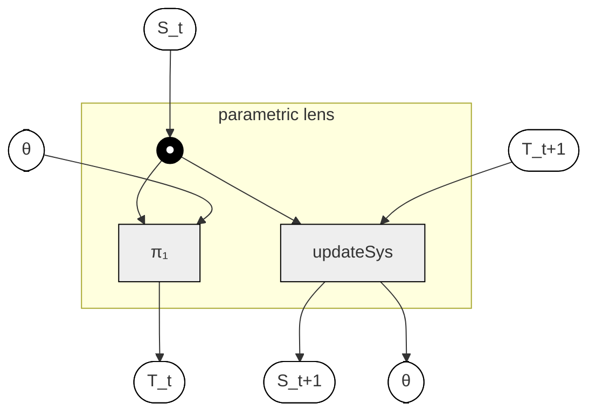
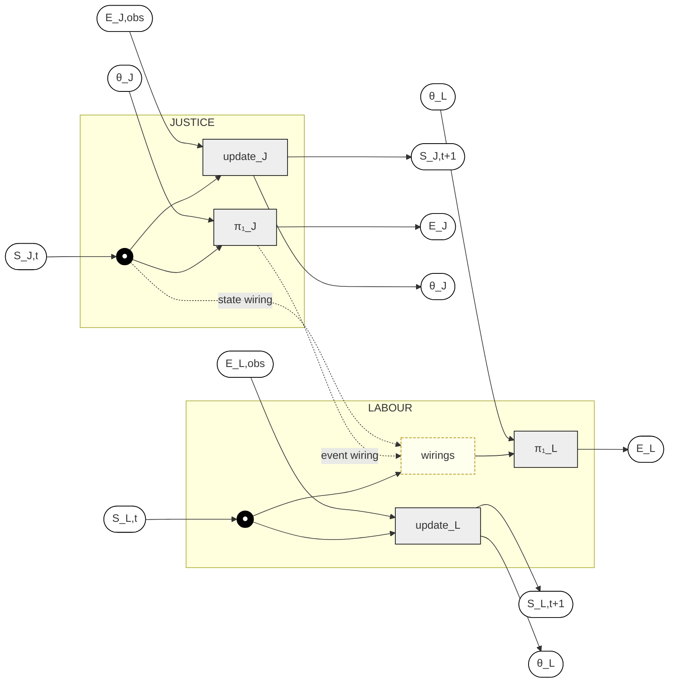

# The Labour–Justice System as a Parametric Lens Diagram

**Companion to [`labour-prison-demo.md`](labour-prison-demo.md).** The
demo file shows the labour-market and prison composition as runnable
Python. This file draws the same system as a **parametric-optic
diagram**, in the four-port lens style used in `index.md` and in the
broader applied-category-theory literature.

The diagram lets you see *visually* why the two flavours of wiring
(state-based and event-based) live where they do, and why parameter
updates remain local to each subsystem even when behaviour is coupled.

---

## Table of contents

- [1. The single-subsystem shape](#1-the-single-subsystem-shape)
- [2. The composite Justice ⊗ Labour](#2-the-composite-justice--labour)
- [3. Reading the diagram](#3-reading-the-diagram)
- [4. Where the two flavours of wiring live in the picture](#4-where-the-two-flavours-of-wiring-live-in-the-picture)
- [5. Why parameter updates stay local](#5-why-parameter-updates-stay-local)
- [6. Connections to the main book](#6-connections-to-the-main-book)

---

## 1. The single-subsystem shape

Each subsystem is a four-port parametric lens. Parameters enter from
the top, state from the left, observables and feedback travel along
the right edge, and updated parameters exit at the bottom.



> [!note] What each port is
>
> - `θ` (top in / bottom out): parameters threaded through the `Para`
>   construction.
> - `S_t` (left in): the current state.
> - `T_t` (right out): the forward observable produced by `π₁`.
> - `T_{t+1}` (right in): the observed event used for calibration.
> - `S_{t+1}` (left out): the next state.
> - `●`: the copy node that forks `S_t` into both the forward leg and
>   the backward leg.

The copy node is the structural reason `updateSys` can be a function of
`(θ, S_t, T_{t+1})` rather than only `(θ, T_{t+1})`: the state seen by
the forward leg is the *same* state threaded down into the update.

---

## 2. The composite Justice ⊗ Labour

Two of these lenses sit side by side, sharing parameter and state
edges. The cross-system rules — wirings — travel along a horizontal
channel in the *forward* half of the diagram, shown as the dashed
arrows pointing into Labour's `wirings` node.



> [!tip]
> The wiring channel only appears in the **top half** of the diagram.
> That is not an accident of drawing — it's the structural claim that
> backward-leg parameter updates remain local to each subsystem even
> when forward behaviour is coupled.

---

## 3. Reading the diagram

Each subsystem keeps the same four-port shape as the single-lens
diagram. The composite just adds one channel between them.

| Edge | What it carries |
| --- | --- |
| Top in | `θ_J`, `θ_L` — parameter wires for each subsystem |
| Left in | `S_J,t`, `S_L,t` — current state of each subsystem |
| Right out (forward) | `E_J`, `E_L` — the events that fire this tick |
| Right in (backward) | `E_J,obs`, `E_L,obs` — empirically observed events for calibration |
| Left out | `S_J,t+1`, `S_L,t+1` — next state of each subsystem |
| Bottom out | updated `θ_J`, `θ_L` |
| **Centre, forward only** | the **wiring channel** that lets Justice influence Labour |

The order of operations on a single tick, read off the diagram:

1. Justice's `π₁_J` fires, producing `E_J` and the prelim `S_J,t+1`.
2. The wiring channel takes `E_J` and the post-step `S_J` and
   adjusts `S_L,t` accordingly.
3. Labour's `π₁_L` fires from the adjusted `S_L,t`, producing `E_L`
   and `S_L,t+1`.
4. Independently, observed events flow back into `update_J` and
   `update_L` to refresh parameters.

---

## 4. Where the two flavours of wiring live in the picture

The demo distinguished a **state-based** wiring (`imprisoned ⇒ NILF`)
from an **event-based** wiring (`imprisoned_to_free → unemployed`).
Both travel through the same wiring channel, but they tap into
different wires on the Justice side.

| Flavour | Reads from | Writes to |
| --- | --- | --- |
| State-based | Justice's **state line** after `π₁_J` (`S_J,t` post-step) | Labour's `S_L,t` before `π₁_L` |
| Event-based | Justice's **event line** (`E_J` out of `π₁_J`) | Labour's `S_L,t` before `π₁_L` |

> [!note]
> Both wirings feed into the same incoming edge on the Labour box. That
> is the diagrammatic explanation of why ordering only becomes
> ambiguous when both want to write the same field: the channel is a
> single wire, and only one value can travel down it. The
> [recommended convention](labour-prison-demo.md#6-two-flavours-of-wiring)
> — event consequences first, state invariants last — is a rule about
> the order of writes onto that single edge.

---

## 5. Why parameter updates stay local

A subtle but important property of this diagram: the wiring channel
exists only in the forward half. The backward half of each subsystem
runs in isolation:

```
   [ update_J ] ← E_J,obs        [ update_L ] ← E_L,obs
        ↓                              ↓
       θ_J                            θ_L
```

There is no horizontal arrow between the two `update_*` blocks. That
is the diagrammatic statement of:

> Parameter spaces compose by tensor product, even when forward
> behaviour is coupled.

i.e. `Θ_joint = Θ_J ⊗ Θ_L`. Justice events update Justice parameters;
Labour events update Labour parameters. The coupling lives in
*dynamics*, not in *calibration*.

> [!warning]
> This local-updates property only holds for **hard coupling** (the
> kind shown here). Once you add **soft coupling** — Justice rates
> depending on Labour state, say — `update_J` would need to read both
> `S_J,t` and `S_L,t`. The diagram would then grow a horizontal arrow
> on the bottom half too, and the calibration schema picks up an extra
> grouping dimension. See `lens-composition-guide.md` §6.3.

---

## 6. Connections to the main book

This diagram is a concrete instance of several structures introduced
abstractly in `index.md`:

- **Module 2 (Yoneda & lenses):** the four-port shape is the
  forward/backward pair derived from the Yoneda decomposition of a
  polynomial functor. Each subsystem's lens has exactly that shape.
- **Module 3 (Para construction):** the `θ` wires entering at the top
  and leaving at the bottom are the parameter wires threaded by `Para`.
- **Module 7 (Wirings, double categories):** the horizontal channel
  between the two subsystem boxes is a 2-cell in the double category
  of wirings. The channel commutes with the lens-composition structure
  because wirings *are* the horizontal morphisms of that double
  category.
- **Module 10 (Calibration as backward leg):** the bottom half of each
  box is exactly the backward leg used for calibration. Their lack of
  a horizontal connecting arrow is the modular calibration story.

> [!summary]
> Two boxes, one horizontal channel in the forward half, and no
> channel in the backward half. That is system composition drawn as a
> picture.
